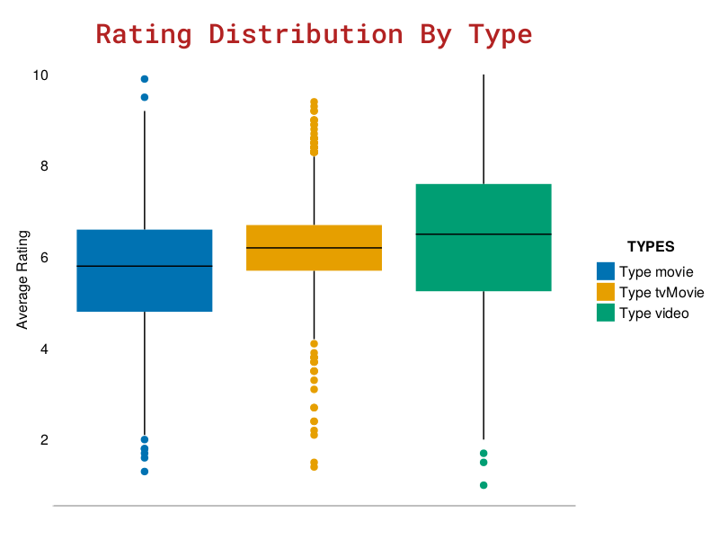

# Holiday MOvies
- **Data published date: 2023-12-12**
- **Tidytuesday Week: 50**
***
 

### Packages
Pkg Status:
 - <a href="https://csv.juliadata.org/stable/">CSV</a> v0.10.11
 - <a href="https://github.com/jkrumbiegel/Chain.jl">Chain</a> v0.5.0
 - <a href="https://dataframes.juliadata.org/stable/">DataFrames</a> v1.6.1
 - <a href="https://github.com/TidierOrg">Tidier</a> v1.2.0
 - <a href="https://categoricalarrays.juliadata.org/stable/">CategoricalArrays</a> v0.10.8

### Data
Data source: <a href="">Weekly Data </a>

Data attributes:
|variable|class|description|
|-|-|-|
|variable|class|description|

### Wrangling and Viz

<b>Final plot:</b>  

  

 

### Insights